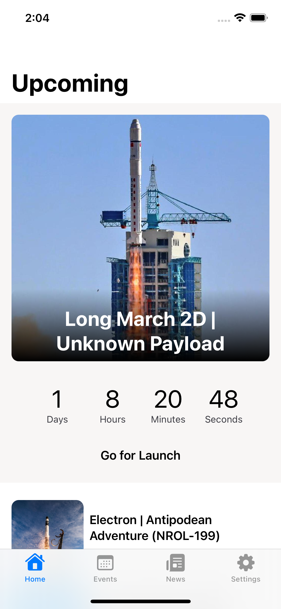
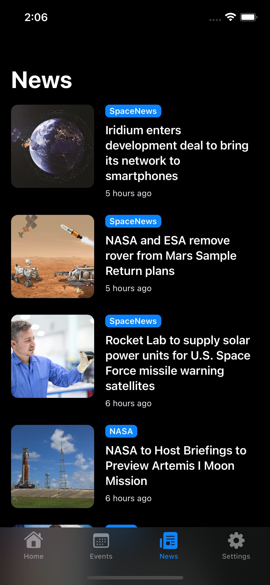

# Frontier
Get the latest rocket launch and space news

## Screenshots

  
  

## API
* Launch data powered by [Launch Library API](https://thespacedevs.com/)
* News provided by [SpaceFlight News API](https://github.com/spaceflightnewsapi/spaceflightnewsapi)

## Purpose
* Side project to build an app completely in SwiftUI
